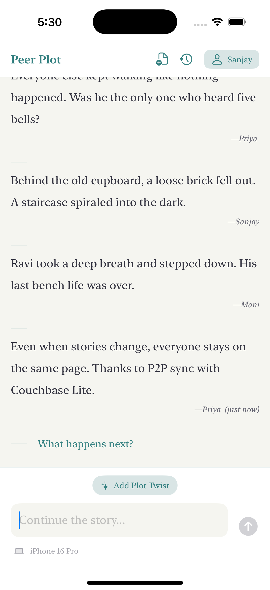

# PeerPlot

## Collaborative Storytelling with Couchbase Lite P2P Sync

PeerPlot is a collaborative storytelling application that lets multiple users create stories together in real-time, even without constant internet connectivity. Users can add entries to an evolving narrative, suggest plot twists, and browse through story history - all while seamlessly syncing across devices.



## 🚀 Why This Matters for Developers

PeerPlot demonstrates how Couchbase Lite solves real-world collaboration challenges with:

- **Offline-first sync** for uninterrupted creativity (planes, remote areas, spotty Wi-Fi)
- **Zero-server architecture** using direct P2P communication
- **Automatic conflict resolution** for seamless merging of story contributions

> "What if your app worked as smoothly offline as it does online?"

## ✨ Key Features

| Feature | Couchbase Lite Superpower |
|---------|---------------------------|
| 📖 **Collaborative Writing** | Multi-device sync with Replicator |
| ⚡ **Real-Time Updates** | LiveQuery for instant UI refresh |
| ✈️ **Offline-First** | Local database persistence |
| 🤝 **Conflict Resolution** | Custom merging algorithm |

## 🛠️ Tech Stack Deep Dive

### Core Frameworks
- **SwiftUI**: For building the modern, responsive UI
- **Couchbase Lite**: For document storage and sync
- **Network.framework**: For peer-to-peer device discovery and connectivity

### Couchbase Lite in Action

```swift
// Simplified Sync Setup 
let app = AppService(
    database: database,
    conflictResolver: DefaultConflictResolver(),
    identity: identity,
    ca: ca
)

// Start P2P sync
app.start()
```

### App Architecture

#### Core Components
- **Views**: SwiftUI interfaces for story creation and browsing
  - `StoryView`: Main interface for collaborative writing
  - `StoryHistoryView`: Browse archived stories
  - `StoryHistoryDetailView`: View a specific archived story

- **Services**: Backend functionality
  - `DatabaseManager`: Manages Couchbase document storage
  - `AppService`: Handles peer-to-peer networking and sync

- **Data Flow**
1. User adds entry via the UI
2. Entry saved to local database by DatabaseManager
3. AppService detects change and syncs to nearby devices
4. Other devices receive update and update their UI

## 📥 Getting Started

### Requirements
- iOS 18.0+
- Xcode 16.0+
- Swift 5.0+
- Couchbase Lite Framework (Enterprise Edition)

### Download Dependencies
1. Register and download Couchbase Lite Enterprise Edition from [Couchbase Downloads](https://www.couchbase.com/downloads/)
2. Add the downloaded framework to the project's Frameworks directory

### Setting Up Credentials for P2P Sync

Before running the app, you'll need to generate TLS credentials for secure device-to-device communication:

1. Run the included script to generate the required certificate files:
   ```bash
   ./gen-credentials.sh
   ```

2. This script creates:
   - A .p12 identity file for your device's identification
   - A .der certificate file for trust verification

3. These files needs to be copied under Services -> Security -> Resources folder.

> **Note**: For development purposes, the script creates self-signed certificates. In a production environment, you would use properly validated certificates from a trusted authority.

### Running the App
1. Clone the repository
2. Open PeerPlot.xcodeproj in Xcode
3. Build and run on a simulator or device

### Testing Peer-to-Peer Sync
For the best experience, run the app on two devices (simuator or physical devices) on the same network to see real-time synchronization in action.

## Demo App Limitations

This is a demonstration app showcasing Couchbase Lite's peer-to-peer synchronization capabilities. As such:

- Security is simplified for demo purposes
- The conflict resolution system is optimized for storytelling use cases
- Device discovery works best on local networks

## 📚 Resources 

This demo app was built with help from the following resources:

- [Simple Sync](https://github.com/waynecarter/simple-sync) - A demonstration app showing how to read, write, search, and sync data using Couchbase Lite
- [Couchbase P2P Sync Solutions](https://www.couchbase.com/solutions/peer-to-peer/) - Official documentation on peer-to-peer sync capabilities
- [Building P2P Apps with Couchbase Mobile](https://www.youtube.com/watch?v=k0eGxp6YmpU) - YouTube tutorial on building peer-to-peer applications
- [Couchbase P2P Sync Demo](https://www.youtube.com/watch?v=4J1-B6lyUcA) - Video demonstration of peer-to-peer synchronization

## License

MIT License

Copyright (c) 2025 PeerPlot Contributors

Permission is hereby granted, free of charge, to any person obtaining a copy
of this software and associated documentation files (the "Software"), to deal
in the Software without restriction, including without limitation the rights
to use, copy, modify, merge, publish, distribute, sublicense, and/or sell
copies of the Software, and to permit persons to whom the Software is
furnished to do so, subject to the following conditions:

The above copyright notice and this permission notice shall be included in all
copies or substantial portions of the Software.

THE SOFTWARE IS PROVIDED "AS IS", WITHOUT WARRANTY OF ANY KIND, EXPRESS OR
IMPLIED, INCLUDING BUT NOT LIMITED TO THE WARRANTIES OF MERCHANTABILITY,
FITNESS FOR A PARTICULAR PURPOSE AND NONINFRINGEMENT. IN NO EVENT SHALL THE
AUTHORS OR COPYRIGHT HOLDERS BE LIABLE FOR ANY CLAIM, DAMAGES OR OTHER
LIABILITY, WHETHER IN AN ACTION OF CONTRACT, TORT OR OTHERWISE, ARISING FROM,
OUT OF OR IN CONNECTION WITH THE SOFTWARE OR THE USE OR OTHER DEALINGS IN THE
SOFTWARE.
